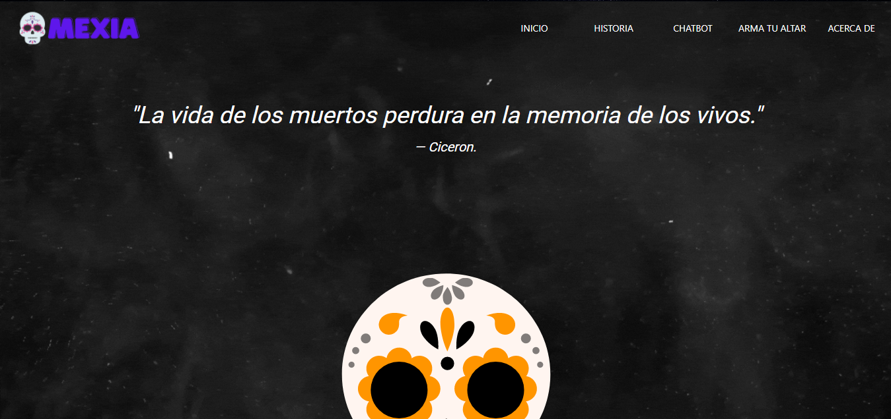
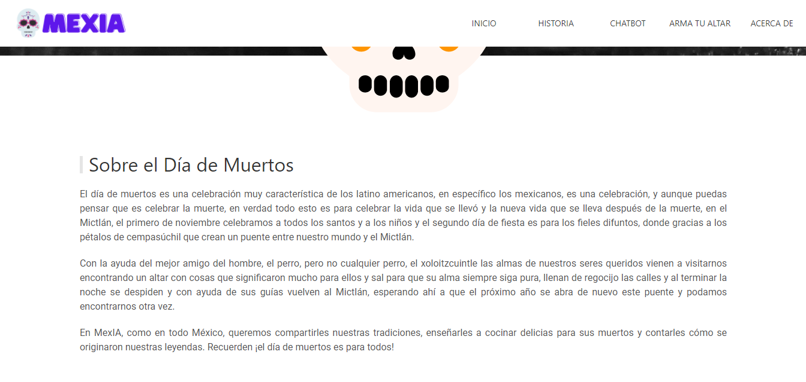
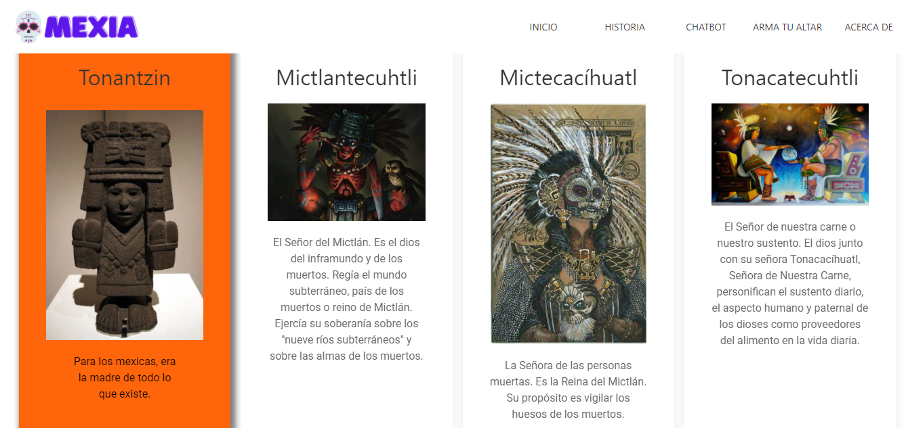
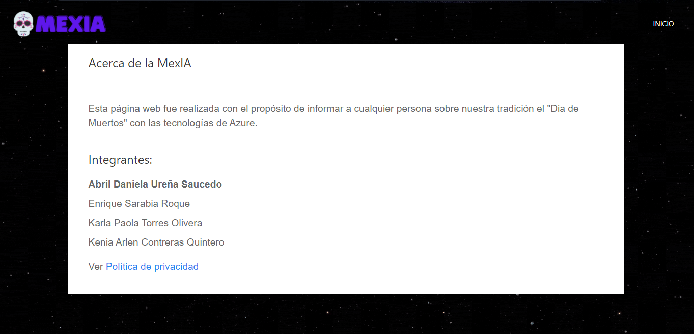
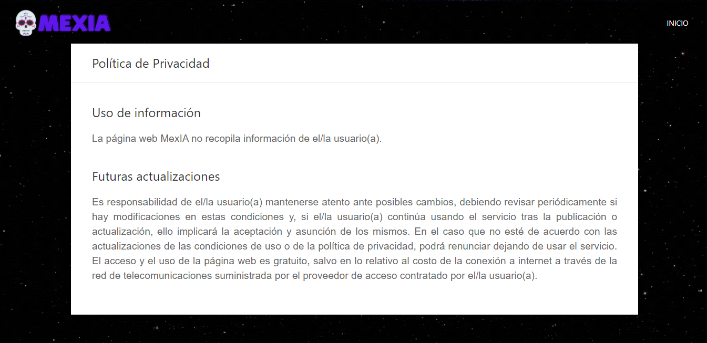
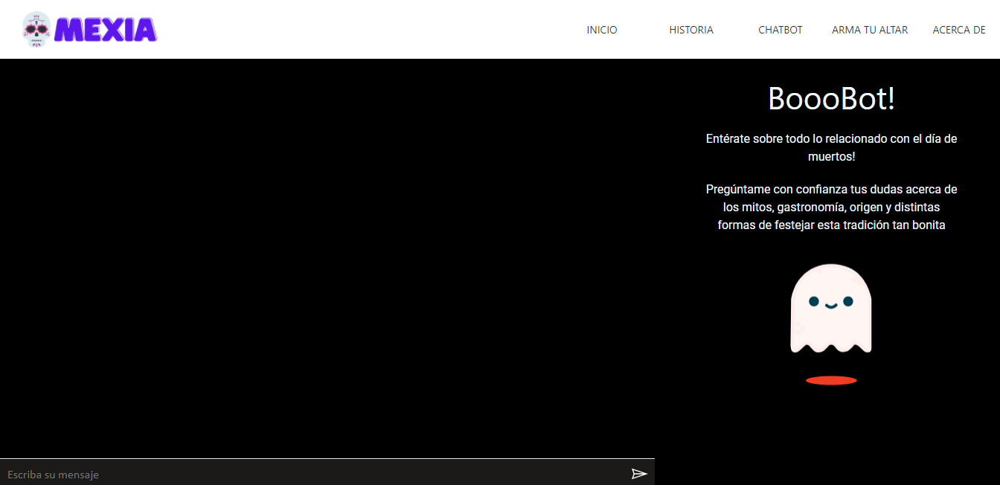
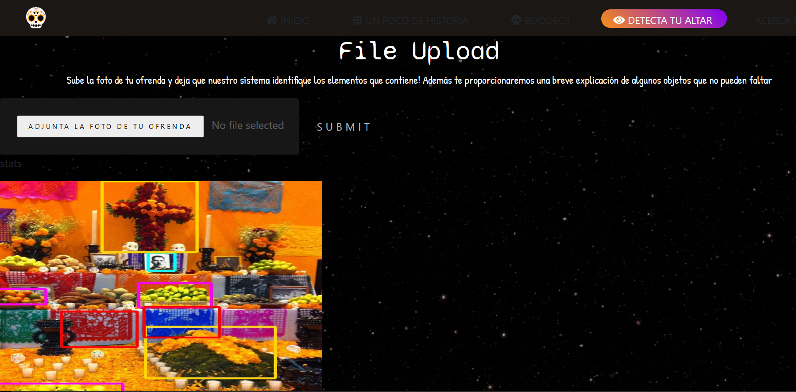
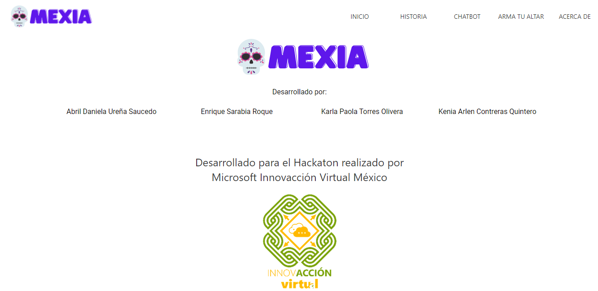

# mexIA https://mexia.azurewebsites.net/
Pagina web relacionada con Azure (Chatbot y Cognitive Services) sobre el dia de los muertos con un toque mistico.
Proyecto desarrollado para el Hackaton de Innovacción Virtual México. 
Pagina principal

Sobre las Deidades

Acerca de 

Política de Privacidad

## Descripción del proyecto

Nuestro proyecto MexAI se encarga de crear un espacio donde la inteligencia artificial y el día de muertos conviven para extender nuestra cultura. Se trata de un entorno interactivo donde el usuario puede hacer distintas actividades(relacionadas con la inteligencia artificial), por ejemplo subir una foto de un altar y que el sistema reconozca los elementos importantes y tradicionales con custom vision, un chatbot de preguntas frecuentes sobre la cultura y temas variados del día de muertos. Nosotros consideramos que el día de muertos abarca demasiadas cosas hermosas que nos hacen sentir cerca de nuestros seres difuntos, es por esto que decidimos dar una pequeña probadita de todo para que se queden con ganas de saber más.

## ¿Qué hace el proyecto?

Haciendo uso de la inteligencia artificial, creamos un ChatBot (boooBot) el cual contesta preguntas sobre el día de muertos, puede brindar recetas de las comidas que se suelen poner en una ofrenda como el pan de muerto, las calaveritas de azúcar, etc. pero no solo eso; también proporciona información sobre los significados de los diferentes elementos que se ponen en un altar. Y finalmente puede responder preguntas sobre algunos datos de cultura, mitos y la manera en que se festeja esta gran fecha en otros lugares. Como segundo elemento se implemento un programa capaz de detectar los elementos comunes en una ofrenda, haciendo uso igualmente de la inteligencia artificial, ¿pero cómo funciona? es muy simple, el usuario puede subir una foto de su altar al sitio web, nuestro programa identificará los elementos de esta y colocará un cuadro a su alrededor con un código de colores, por ejemplo, los retratos de color azul, las flores de color naranja, etc. Además proporciona un pequeño resumen de qué significa cada cosa!

## ¿Cómo funciona el proyecto?
### Boobot
Funcionamiento de nuestro querido boobot, demasiado amigable:

### Detecta tu altar
Funcionamiento de la detección de los elementos en altares de muerto:

## ¿Cómo lo hace?
Se hizo uso del lenguaje Python para realizar la parte de reconocimiento de objetos en las ofrendas con ayuda de la herramienta Custom Vision de Azure. Para la parte del boooBot se creó una base en QnA con apróximadamente 50 preguntas sobre temas de varias categorías.

## Retos a los que nos enfrentamos
El primer reto al que nos enfrentamos fue al conocimiento que teníamos sobre las herramientas que habíamos planeado utilizar, mientras elaborabamos el proyecto salian más dudas y realizabamos las investigaciones correspondientes, otro factor fue el tiempo, debido a que cada uno de nosotros tenía clases o tareas pendientes por lo que no le pudimos dedicar el tiempo que nos hubiera gustado, sin embargo, pudimos realizar un proyecto que podemos mejorar a futuro.

## ¿Qué aprendimos?
Debemos estar en constante aprendizaje, cada vez salen más herramientas y es muy curioso cómo estas te ayudan a realizar tareas que tal vez se consideran complicadas, pero que dedicandoles tiempo te das cuenta que no son tan complejas y que son muy atractivas.

## ¿Qué sigue?
Seguir aprendiendo sin límites!

## Integrantes
ABRIL DANIELA UREÑA SAUCEDO viajero34982@innovaccion.mx
Sarabia Roque Enrique viajero01746@innovaccion.mx 
Torres Olivera Karla Paola viajero01749@innovaccion.mx 
KENIA ARLEN CO CONTRERAS QUINTERO viajero33562@innovaccion.mx

